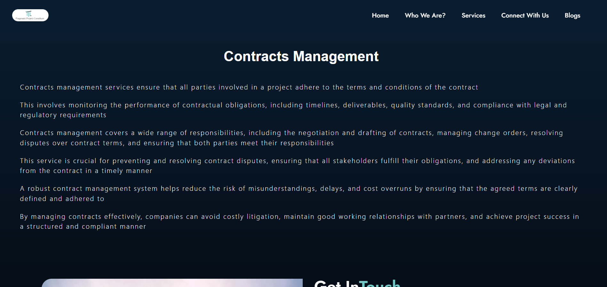

# 🌐 Pragmatic Project Consilium (Business Website)

A modern, interactive business website built using **React.js**, featuring a 3D globe for client geographical visualization, circular service representation, and a roadmap to showcase the company's workflow.

## 📌 About the Project

This project provides an engaging and professional platform for businesses to:
- Display global client reach using an **interactive 3D globe** (Three.js)
- Showcase their **services in a circular innovative layout**
- Walk visitors through the **stepwise roadmap** of how the company works

## Pages

- Home Page


- Blogs Page


- Services Page


- Connect With us Page


---

## 🚀 Technologies Used

- **React.js** – Component-based UI development
- **Three.js** – 3D graphics rendering for interactive globe ( used Mesh Standard Material and 4 Lights added (2 DirectionalLight, 1 AmbientLight, 1 HemisphereLight) )
- **Axios** – For HTTP requests
- **AOS (Animate On Scroll)** – Smooth scroll-triggered animations ( Restricted animation only executes for one time per tab using localStorge)

---

## 🗂️ Folder Structure

```
frontend/
├── node_modules/
├── public/
├── src/
│   ├── components/    # Reusable UI components
│   ├── pages/         # Page-level components
├── index.js
├── index.css
└── package.json
```

---

## 📦 Installation & Setup

1. **Clone the repository**
   ```bash
   git clone https://github.com/25sudharsan27/pragmatic-project.git
   cd pragmatic-project
   ```

2. **Install dependencies**
   ```bash
   npm install
   ```

3. **Start the development server**
   ```bash
   npm start
   ```

Open [http://localhost:3000](http://localhost:3000) to view it in your browser.

## 📸 Features

- 🌍 Interactive 3D Globe (using Three.js)
- 💠 Circular UI for Services
- 🧭 Step-by-step Roadmap section
- 🎨 Scroll animations with AOS
- 📱 Responsive Design

## 🧪 Scripts

| Command | Description |
|---------|-------------|
| `npm start` | Run the app in dev mode |
| `npm run build` | Build the app for production |
| `npm test` | Launch test runner |
| `npm run eject` | Eject the app (not recommended) |

## 🐛 Common Errors & Solutions

| Error | Solution |
|-------|----------|
| **3D globe not displaying** | Make sure Three.js is imported correctly and the canvas is properly mounted |
| **AOS animations not working** | Ensure you initialized AOS in `useEffect()` or `componentDidMount` and imported AOS styles |
| **CORS error on API requests** | Enable CORS on the backend or use a proxy in development |
| **Environment variables not loading** | Ensure `.env` is placed at the root and variables are prefixed with `REACT_APP_` |
| **Blank page after deployment** | Check `homepage` in `package.json` and make sure all assets are correctly linked |

## 📄 License

This project is open-source and available under the MIT License.

## 🤝 Acknowledgements

- [Three.js Documentation](https://threejs.org/docs/)
- [AOS Library](https://michalsnik.github.io/aos/)
- [React Documentation](https://reactjs.org/docs/)

---
